# 🚀 AssayBio 网站部署指南

## 概述

本项目提供了多种部署方式，包括传统的脚本部署和现代化的 GitHub Actions CI/CD 自动部署。

## 🎯 快速开始

### 方法一：一键部署脚本（推荐新手）

```bash
# Windows 用户
.\one-click-deploy.bat

# 或使用 PowerShell
.\quick-deploy.ps1

# Linux/Mac 用户  
./deployment/scripts/auto-deploy-to-server.sh
```

### 方法二：GitHub Actions CI/CD（推荐）

1. **设置 GitHub Secrets**
   - `PRODUCTION_PASSWORD`: 服务器密码 `rtN8gHpcZRM01K2v97`

2. **推送代码触发部署**
   ```bash
   git add .
   git commit -m "Deploy to production"
   git push origin main
   ```

3. **手动触发部署**
   - 访问 GitHub Actions 页面
   - 选择 "AssayBio CI/CD Pipeline"
   - 点击 "Run workflow"

## 🏗️ CI/CD 流程说明

### 自动化流程

```mermaid
graph LR
    A[代码推送] --> B[代码质量检查]
    B --> C[构建和测试]
    C --> D[安全扫描]
    D --> E[Docker构建]
    E --> F[部署到生产]
    F --> G[健康检查]
    G --> H[部署通知]
```



### 流程详解

1. **🔍 代码质量检查**
   - ESLint 代码规范检查
   - TypeScript 类型检查
   - 依赖安全审计

2. **🏗️ 构建和测试**
   - 自动生成版本号
   - 多重构建策略（容错性强）
   - 构建产物验证
   - 自动化测试（如果配置）

3. **🐳 Docker 构建**
   - 多阶段构建优化镜像大小
   - GitHub Container Registry 存储
   - 构建缓存优化
   - 镜像安全扫描

4. **🚀 生产部署**
   - 零停机部署
   - 自动备份当前版本
   - nginx 配置优化
   - 健康检查验证

## 🛠️ 部署配置

### 服务器信息
- **IP**: 192.3.11.106
- **用户**: root
- **端口**: 22
- **访问地址**: http://192.3.11.106

### 技术栈
- **构建工具**: Vite + TypeScript
- **Web服务器**: Nginx
- **容器化**: Docker (可选)
- **CI/CD**: GitHub Actions

## 📋 部署环境要求

### 服务器最低配置
- **操作系统**: Linux (Ubuntu 18+/CentOS 7+)
- **内存**: 1GB+
- **存储**: 5GB+
- **网络**: 公网IP

### 必需软件
- **Nginx**: 自动安装
- **Curl**: 健康检查
- **Docker**: (可选，用于容器化部署)

## 🔧 高级配置

### 环境变量配置

在 GitHub Secrets 中设置：

```bash
# 必需
PRODUCTION_PASSWORD=rtN8gHpcZRM01K2v97

# 可选
DOCKER_USERNAME=your-docker-username
DOCKER_PASSWORD=your-docker-password
GITHUB_TOKEN=ghp_xxxx  # GitHub自动提供
```

### 自定义部署脚本

修改 `.github/workflows/ci-cd.yml` 中的环境变量：

```yaml
env:
  PRODUCTION_SERVER: '192.3.11.106'  # 你的服务器IP
  PRODUCTION_USER: 'root'             # SSH用户名
  NODE_VERSION: '18.x'                # Node.js版本
```

## 📊 监控和维护

### 健康检查

访问健康检查端点：
```bash
curl http://192.3.11.106/health
```

### 查看部署日志

```bash
# 在服务器上查看部署日志
tail -f /var/log/assaybio-deploy.log

# 查看 nginx 日志
tail -f /var/log/nginx/access.log
tail -f /var/log/nginx/error.log
```

### 版本回滚

如果部署出现问题，可以快速回滚：

```bash
# SSH 到服务器
ssh root@192.3.11.106

# 查看可用备份
ls -la /opt/backups/assaybio/

# 回滚到上一个版本
cd /opt/assaybio-website
sudo mv current current-failed
sudo mv /opt/backups/assaybio/backup-YYYYMMDD_HHMMSS current
sudo systemctl reload nginx
```

## 🚨 故障排查

### 常见问题

1. **构建失败**
   ```bash
   # 检查 GitHub Actions 构建日志
   # 常见原因：依赖安装失败、TypeScript错误
   
   # 本地测试构建
   cd apps/website
   npm install
   npm run build
   ```

2. **部署连接失败**
   ```bash
   # 检查服务器连接
   ssh root@192.3.11.106
   
   # 检查防火墙设置
   sudo ufw status
   sudo iptables -L
   ```

3. **网站无法访问**
   ```bash
   # 检查 nginx 状态
   sudo systemctl status nginx
   
   # 重启 nginx
   sudo systemctl restart nginx
   
   # 检查端口占用
   sudo netstat -tlnp | grep :80
   ```

### 日志查看

```bash
# GitHub Actions 日志
# 在 GitHub 仓库的 Actions 页面查看

# 服务器部署日志
tail -100 /var/log/assaybio-deploy.log

# Nginx 访问日志
tail -100 /var/log/nginx/access.log

# 系统日志
sudo journalctl -u nginx -n 50
```

## 🔐 安全最佳实践

1. **定期更新密码**
   - 更新服务器密码
   - 更新 GitHub Secrets

2. **启用防火墙**
   ```bash
   sudo ufw enable
   sudo ufw allow 22
   sudo ufw allow 80
   sudo ufw allow 443
   ```

3. **SSL证书配置**（推荐）
   ```bash
   # 使用 Let's Encrypt 免费证书
   sudo apt install certbot python3-certbot-nginx
   sudo certbot --nginx -d yourdomain.com
   ```

## 📈 性能优化

### Nginx 优化配置

```nginx
# 添加到 nginx 配置中
server {
    # Gzip 压缩
    gzip on;
    gzip_vary on;
    gzip_comp_level 6;
    gzip_types text/plain text/css application/javascript application/json;
    
    # 静态资源缓存
    location ~* \.(css|js|png|jpg|jpeg|gif|ico|svg)$ {
        expires 1y;
        add_header Cache-Control "public, immutable";
    }
    
    # 安全头部
    add_header X-Frame-Options DENY;
    add_header X-Content-Type-Options nosniff;
}
```

### CDN 配置（可选）

推荐使用 Cloudflare 或阿里云 CDN 加速静态资源访问。

## 📞 支持与反馈

如有问题，请：
1. 查看 GitHub Actions 构建日志
2. 检查服务器连接状态
3. 查看部署日志文件
4. 联系技术支持团队

---

## 🎉 部署成功！

部署完成后，你可以通过以下地址访问网站：

**🌐 生产环境**: http://192.3.11.106

**📊 健康检查**: http://192.3.11.106/health

**🚀 部署状态**: GitHub Actions自动化部署已激活

恭喜！你的 AssayBio 网站已成功部署上线！